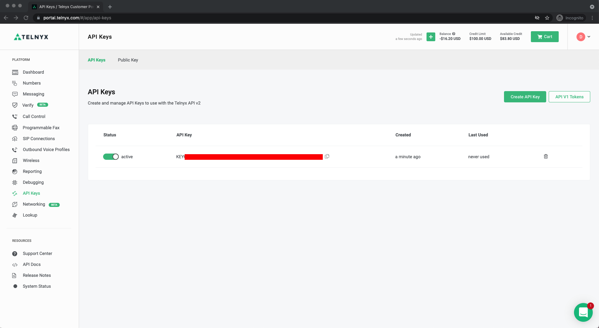

# Frontend Video JS

This is an example app built with Vanilla JS using [@telnyx/video](https://www.npmjs.com/package/@telnyx/video) SDK.

## Getting Started

In this guide, you’ll learn how to get run

Just follow these steps:

1. Sign up for a Telnyx Account
2. Create an API KEY
3. Create a Room ID
4. Set up environment variables
5. Run the code

---

## Step 1: Sign Up for a Telnyx Mission Control Portal Account

Head to [telnyx.com/sign-up](https://telnyx.com/sign-up) to sign up for your free Telnyx account.

Once signed up you will have access to Telnyx Portal, where you can set up and manage your API KEY, and more.

## Step 2: Create an API KEY

Go to [API Keys](https://portal.telnyx.com/#/app/api-keys) section and click on `Create API Key` button. It will generate a key for you. Copy and save this key in a safe place and don't share it with anyone it is a sensitive value.

You need this API Key to consume the API `https://api.telnyx.com/v2/rooms` to manage your room ids.

## 

## Step 3: Create a Room ID

You should read this documentation [video/Rooms](https://developers.telnyx.com/docs/api/v2/video/Rooms) to learn how to create a new video room id. When you get your `roomId` you can run the project.

### Step 4. Set up environment variables

Create a new copy of `.env.sample` with the name `.env.local` and set the env var `TELNYX_API_KEY` with your Telnyx API KEY value.

Your `.env.local` file should look like this:

```js
TELNYX_API_URL=https://api.telnyx.com/v2
TELNYX_API_KEY="KEYae7df0................"
TELNYX_ROOM_ID="e6e26b76-................" // optional
```

## Step 5: Run the code

After you have cloned this repo:

```bash
  % git clone https://github.com/team-telnyx/frontend-video-js.git
```

Run the commands

1 - `yarn` to install the dependencies.

2 - `yarn start` will initialize the server.

3 - Access the `http://localhost:1234`
